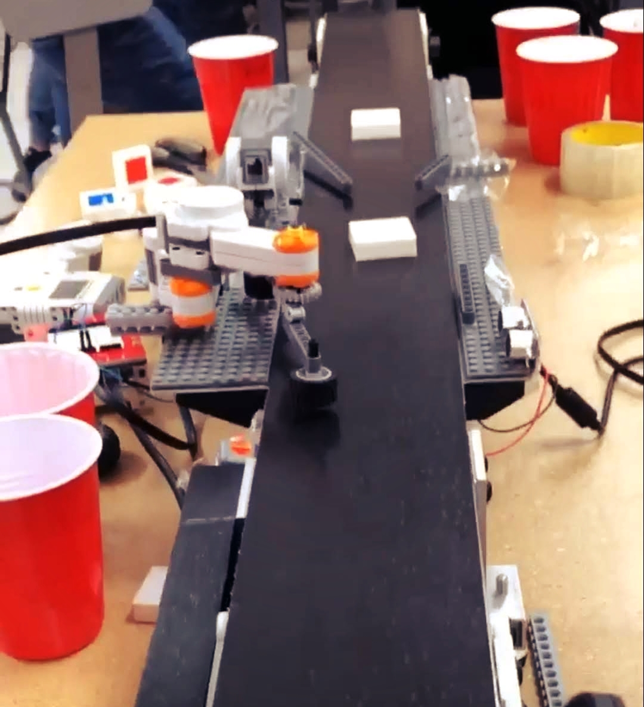

# EVshield-Sorter-Bot
This project utilizises simple color detection to sort blocks on a conveyor. The Arduino sketch utilizes the EV Shield libraries and kit.


> Open loop conveyor belt sorter. A demonstration of rapid prototyping. 

---

### Table of Contents


- [EVshield-Sorter-Bot](#evshield-sorter-bot)
    - [Table of Contents](#table-of-contents)
  - [Description](#description)
      - [Technologies](#technologies)
  - [How To Use](#how-to-use)
      - [Installation](#installation)
      - [API Reference](#api-reference)

---

## Description

This project utilizises simple color detection to sort blocks on a conveyor. The Arduino sketch utilizes the EV Shield libraries and kit. 
The aim of this project was to have the most number of correct sort actions in the least time. 
To achieve this, an open loop control system was used, that worked on timing the actions correctly. This allowed the system to be very fast, but also only good for that particular setup. 


#### Technologies

- arduino
- C/C++
- EV-shield (lego)
[Back To The Top](#read-me-template)

---

## How To Use

#### Installation
To load onto the arduino you can use the regular arduino IDE. for the system to work you require:

- EV shield
- 2 lego motors
- 1 distance sensor (ultra sonic)
- arduino

#### API Reference

```c++
    /*to calibrate change the deg variable*/
    deg = 100;
    /*The cups are at:*/
    //change for red cup location
    evshield.bank_b.motorRunDegrees(SH_Motor_2, SH_Direction_Reverse, SH_Speed_Full, deg + 80, SH_Completion_Wait_For, SH_Next_Action_Brake);
    //change for blue cup location
    evshield.bank_b.motorRunDegrees(SH_Motor_2, SH_Direction_Forward, SH_Speed_Full, deg + 70, SH_Completion_Wait_For, SH_Next_Action_Brake);

    /*use delay to adjust the distance between the distance sensor and the grab feature. */
    //Open grabber delay 300 and then close.
    if (1 == detect()) {
    //Open grabber delay 300 and then close.
    delay(300);
    grabber('G');
    Serial.println(detect());
    }

    

```
[Back To The Top](#read-me-template)


